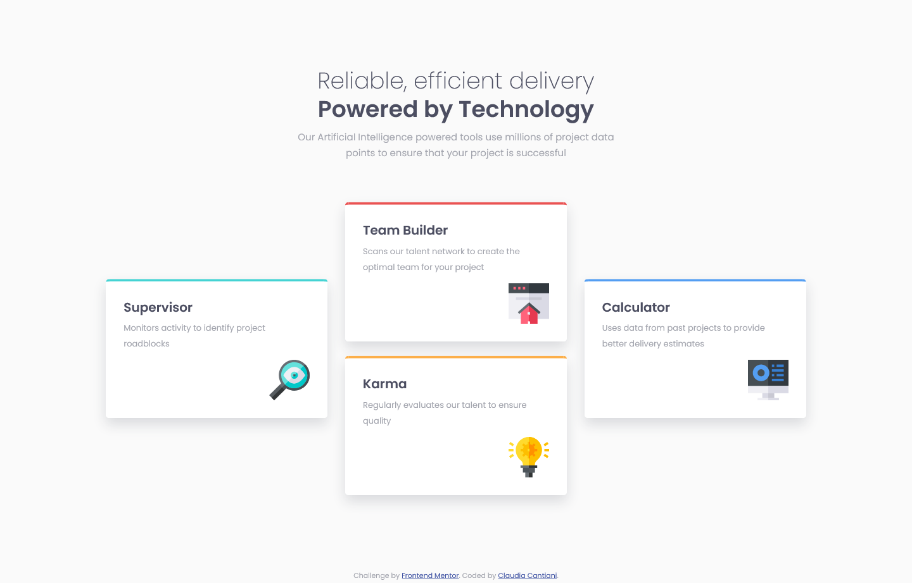

# Frontend Mentor - Four card feature section solution

This is a solution to the [Four card feature section challenge on Frontend Mentor](https://www.frontendmentor.io/challenges/four-card-feature-section-weK1eFYK). Frontend Mentor challenges help you improve your coding skills by building realistic projects.

## Table of contents

- [Overview](#overview)
  - [The challenge](#the-challenge)
  - [Screenshot](#screenshot)
  - [Links](#links)
- [My process](#my-process)
  - [Built with](#built-with)
  - [What I learned](#what-i-learned)
  - [Continued development](#continued-development)
  - [Useful resources](#useful-resources)
- [Author](#author)

## Overview

### The challenge

Users should be able to:

- View the optimal layout for the site depending on their device's screen size

### Screenshot




### Links

- Solution URL: [Add solution URL here](https://your-solution-url.com)
- Live Site URL: [Add live site URL here](https://your-live-site-url.com)

## My process

### Built with

- Semantic HTML5 markup
- CSS custom properties
- CSS Grid
- Mobile-first workflow

### What I learned

I learned the use of min() and clamp() and I found them to be really useful. I used them for:

```css
.page {
  /* width: 82.7%;
  max-width: 1110px; */
  width: min(1110px, 82.7%);
}
```
```css
.feature h1 {
  font-size: clamp(2.5rem, 5vw, 3.6rem); /* responsive font-size */
}
```

It was also the first time I used the ch unit. And for paragraphs I think it's probably the best I've ever used.

### Continued development

Right now I'm trying to use media queries not for layout, but to adjust here and there the already responsive layout, like adjusting paddings, margins or font-sizes.
But it's something that I don't think is practical in big website, especially if they change the design often. So for them I'll probably use the media queries for layout.

### Useful resources

- [Kevin Powell's video on units](https://www.youtube.com/watch?v=N5wpD9Ov_To&t=144s) - This is where I got to know ch unit and also using percentage in the root to take the 16px default size to 10px without overwriting it
- [kevin Powell's video on min(), max(), clamp()](https://www.youtube.com/watch?v=U9VF-4euyRo) - This is where I learned about clamp()

## Author

- Frontend Mentor - [@cla91](https://www.frontendmentor.io/profile/cla91)
